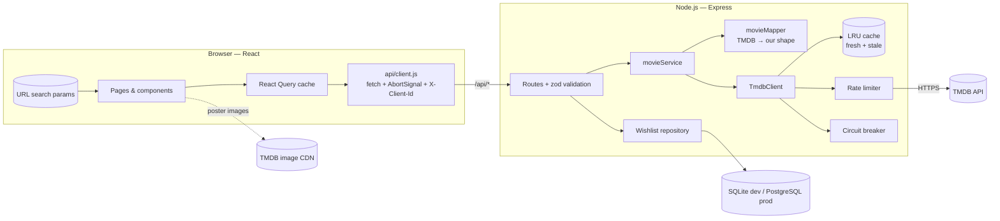

# 🎬 ReelHunt — Movie Discovery App

A full-stack movie discovery app: browse, search, filter and sort a catalogue of hundreds of thousands of movies, open rich detail pages, and keep a persistent wishlist.

**React (Vite) + Node.js (Express)**, with movie data from [TMDB](https://www.themoviedb.org/) served through my own backend.

> 🔗 **Live demo:** `https://<your-app>.onrender.com`  ·  🎥 **Video walkthrough:** `<your Loom / Drive link>`

---

## Contents
1. [Features](#features)
2. [Quick start](#quick-start)
3. [Architecture](#architecture)
4. [API reference](#api-reference)
5. [Important technical decisions](#important-technical-decisions)
6. [Handling real-world scenarios](#handling-real-world-scenarios)
7. [Testing](#testing)
8. [Deployment](#deployment)
9. [Assumptions](#assumptions)
10. [Known limitations](#known-limitations)
11. [AI tools used](#ai-tools-used)
12. [What I would improve with more time](#what-i-would-improve-with-more-time)

---

## Features

| User need (from the brief) | How ReelHunt handles it |
|---|---|
| Discover without searching | Home page opens with a featured "most watched this week" banner, a *Trending this week* shelf and a *Popular right now* grid |
| Search | Search-as-you-type, debounced (350 ms), `/` keyboard shortcut |
| Explore by categories/attributes | Genre chips (multi-select), release year, minimum rating, original language (incl. Hindi, Tamil, Telugu, Malayalam…) |
| Change ordering | 7 sort options: popularity, rating, newest, oldest, title A–Z / Z–A, box office |
| Continue exploring large result sets | Infinite scroll with a "Load more" fallback, de-duplicated across pages, "back to top" button |
| Movie details | Backdrop, poster, tagline, runtime, rating & votes, genres (clickable), trailer, director, languages, budget/box office, cast, "More like this" |
| Persistent wishlist | Saved server-side in a database; survives closing the browser. Optimistic UI + Undo; sort/filter/search inside the wishlist |
| Navigate without losing context | Filters live in the URL; lists are cached; scroll position is restored on Back; details page shows the card's data instantly while full details load |
| Loading / empty / error feedback | Skeletons, dimmed previous results while filters change, empty states with next steps, retryable errors, offline banner, "showing saved results" banner |
| Different screens | Fluid grid (2 columns on small phones → 7+ on desktop), mobile header layout, 2-column filters on phones, touch-scrollable shelves |

---

## Quick start

### Prerequisites
- **Node.js 20+** (`node -v`)
- A free **TMDB API Read Access Token** → create an account at themoviedb.org → *Settings → API*. *(Optional: mock mode needs no key.)*

### Option A — Offline mock mode (no API key, no internet)
```bash
npm install
npm run dev:mock
```
Open **http://localhost:5173**. This starts a local fake TMDB (`server/scripts/mockTmdb.js`) with ~6,000 generated movies that deliberately includes the messy cases: very long titles, missing posters, square/wide "posters", missing dates/ratings, duplicate items across pages and variable latency.

Simulate a slow/unreliable upstream:
```bash
# macOS/Linux
MOCK_LATENCY_MS=2000 MOCK_FAILURE_RATE=0.3 npm run dev:mock
# Windows PowerShell
$env:MOCK_LATENCY_MS=2000; $env:MOCK_FAILURE_RATE=0.3; npm run dev:mock
```

### Option B — Real TMDB data
```bash
npm install
cp server/.env.example server/.env      # Windows: copy server\.env.example server\.env
# edit server/.env → TMDB_READ_TOKEN=eyJhbGciOi...
npm run dev
```
- Frontend: http://localhost:5173 (Vite, proxies `/api` to the backend)
- Backend: http://localhost:4000 → check http://localhost:4000/api/health

The wishlist is stored in `server/data/reelhunt.db` (SQLite, created automatically).

### Production build locally
```bash
npm run build     # builds the React app into client/dist
npm start         # Express serves the API *and* the built app on http://localhost:4000
```

### Scripts
| Command | What it does |
|---|---|
| `npm run dev` | Backend (auto-restart) + frontend (hot reload) |
| `npm run dev:mock` | Same, against the offline mock TMDB |
| `npm test` | Backend test suite (32 tests, Node's built-in test runner) |
| `npm run build` | Production build of the frontend |
| `npm start` | Production server |

---

## Architecture



### Project structure
```
reelhunt/
├── client/                     React app (Vite)
│   └── src/
│       ├── api/                fetch wrapper, endpoints, React Query client & keys
│       ├── hooks/              useMovieFilters (URL state), useMovieFeed (infinite list),
│       │                       useWishlist, useGenres, useInView, useDebouncedValue …
│       ├── context/            Toasts, wishlist actions (optimistic mutations)
│       ├── components/         MovieCard, MovieGrid, FilterBar, SearchBar, Hero, …
│       ├── pages/              Discover, MovieDetails, Wishlist, NotFound
│       ├── lib/                constants, formatting, anonymous client id
│       └── styles/index.css    design tokens + all styles
├── server/                     Node.js API
│   ├── src/
│   │   ├── index.js            wiring & startup (dependency injection)
│   │   ├── app.js              Express app: security, rate limit, routes, static hosting
│   │   ├── config.js           env parsing/validation (fails fast)
│   │   ├── routes/             movies.js, wishlist.js
│   │   ├── services/           movieService.js — business rules (sorting, filtering)
│   │   ├── mappers/            movieMapper.js — defends against bad upstream data
│   │   ├── lib/                tmdbClient, ttlCache, rateLimiter, circuitBreaker, errors
│   │   ├── middleware/         validation, client id, error handler
│   │   └── db/                 schema.sql, SQLite + PostgreSQL repositories
│   ├── scripts/mockTmdb.js     offline TMDB mock
│   └── test/                   unit + API tests
├── render.yaml                 one-click deployment
└── .github/workflows/ci.yml    tests + build on every push
```

### How data flows (example: user picks "Horror" on page 1)
1. `FilterBar` calls `setFilters({ genres: [27] })` → the **URL** becomes `/?genres=27`.
2. `useMovieFilters` parses the URL; `useMovieFeed` builds the query key `['movies', {genres:[27], sort:'popularity', …}]`.
3. **React Query** has no data for that key → calls `GET /api/movies?genres=27&page=1`, passing an `AbortSignal` (the previous request is cancelled if the user changes filters again). Old results stay on screen, dimmed.
4. **Express** validates the query with zod → `movieService.discover()` maps our `sort=popularity` to TMDB params.
5. **TmdbClient**: cache hit? → return. Same request already in flight? → share it. Circuit open? → fail fast. Otherwise wait for the **rate limiter**, fetch with a timeout, retry on 429/5xx.
6. **movieMapper** turns raw TMDB JSON into clean `MovieSummary` objects (drops broken items, dedupes, builds image URLs).
7. The response is cached server-side (10 min) and client-side, and rendered by `MovieGrid`. Scrolling near the bottom triggers page 2 via an `IntersectionObserver`.

---

## API reference

All errors use one shape: `{ "error": { "code": "UPSTREAM_TIMEOUT", "message": "…", "details": [...] } }`.

| Method & path | Description |
|---|---|
| `GET /api/movies` | Main feed. Query: `q`, `page` (1–500), `sort` (`popularity`\|`rating`\|`newest`\|`oldest`\|`title_asc`\|`title_desc`\|`revenue`), `genres` (comma list, max 5), `year`, `minRating` (0–10), `language` (ISO 639-1). With `q` → search mode, otherwise discover mode. |
| `GET /api/movies/trending?window=week` | Trending movies (`day` or `week`) |
| `GET /api/movies/:id` | Full details incl. cast, directors, trailer, related movies |
| `GET /api/genres` | Genre list |
| `GET /api/wishlist` | The caller's wishlist *(header `X-Client-Id` required)* |
| `PUT /api/wishlist/:movieId` | Save a movie (idempotent). Body: `{ title, posterPath, releaseDate, rating, genreIds }` |
| `DELETE /api/wishlist/:movieId` | Remove a movie (idempotent, `204`) |
| `GET /api/health` | DB status + upstream metrics (cache hits, deduped calls, retries, circuit state) |

List responses: `{ page, totalPages, totalResults, results: MovieSummary[], stale, mode, filteredLocally? }`

```jsonc
// MovieSummary
{ "id": 27205, "title": "Inception", "year": 2010, "releaseDate": "2010-07-15",
  "rating": 8.4, "voteCount": 36000, "genreIds": [28, 878], "language": "en", "overview": "…",
  "poster":   { "path": "/abc.jpg", "sm": "…/w185/abc.jpg", "md": "…/w342/abc.jpg", "lg": "…/w500/abc.jpg", "xl": "…/w780/abc.jpg" },
  "backdrop": { "path": "/xyz.jpg", "sm": "…/w780/xyz.jpg", "lg": "…/w1280/xyz.jpg", "original": "…" } }
```

---

## Important technical decisions

**1. A backend-for-frontend instead of a thin proxy.**
The backend owns the contract with the client: it exposes *our* sort names (`rating`, not `vote_average.desc`), merges TMDB's two endpoints (search vs discover) into one `/api/movies`, and reshapes data. The TMDB token never reaches the browser. Swapping to another movie provider would only touch `tmdbClient.js` + `movieMapper.js`.

**2. Layered backend with dependency injection.**
`routes → service → client/mapper`, and `repository` for the DB. `createApp()` receives its dependencies, so tests run the real Express app against a fake `fetch` and an in-memory SQLite database — no network, no mocks of internal modules.

**3. Caching at three levels.**
- *Server* (in-memory LRU): TTLs chosen per data type — lists 10 min, trending 30 min, details 6 h, genres 24 h. Entries are kept as **stale** for 24 h after expiring, purely as a fallback when TMDB fails.
- *HTTP*: `Cache-Control` with `stale-while-revalidate` on movie data; `no-store` on the personal wishlist.
- *Client*: React Query keyed by filter combination, so returning to earlier filters or pressing Back is instant.

**4. What is stored vs fetched.**
The database stores only what belongs to the user: which movies they saved and when, plus a small **snapshot** (title, poster path, date, rating, genre ids). The wishlist therefore renders in one DB query, even if TMDB is slow or down. Full details are always fetched live (and cached). I store the poster *path*, not the full URL, so image sizes/CDN can change without a data migration.

**5. Anonymous identity instead of login.**
No accounts were required, so each browser generates a UUID (stored in `localStorage`) and sends it as `X-Client-Id`. The wishlist is scoped to it. Replacing this with real auth later only changes one middleware.

**6. SQLite locally, PostgreSQL in production — same interface.**
SQLite means zero setup for reviewers. Free hosting disks are ephemeral, so production uses Postgres (Neon). Both implement the same repository interface; the choice is made from `DATABASE_URL`. Primary key `(client_id, movie_id)` makes "add" idempotent (`PUT`), so double-clicks never create duplicates.

**7. URL as the source of truth for browsing state.**
Search, filters and sort live in query params: shareable links, working Back/Forward, refresh-safe, and the details page → Back returns to the exact list. Filter changes use `replace` so they don't flood history. Garbage in the URL is sanitised instead of causing errors.

**8. React Query for server state, no global store.**
It gives caching, request cancellation, deduplication, retries and infinite pagination out of the box. The only other shared state (toasts, wishlist actions) is small React context.

**9. Optimistic wishlist updates.**
The bookmark toggles instantly; if the request fails it rolls back and shows an error toast. The mutation lives in a provider (not the button), so "Undo" still works after the card unmounts.

**10. Search + filters trade-off.**
TMDB's search endpoint supports only text + year. Rather than hiding genre/rating filters while searching, the backend applies them to each search page, and the client keeps loading pages while results are sparse (it stops auto-loading after 3 empty pages in a row and offers "Load more"). Sort and language are disabled in search mode with an explanation.

---

## Handling real-world scenarios

| Scenario | Handling |
|---|---|
| Same data requested repeatedly | Server LRU cache + HTTP cache headers + React Query cache |
| Many users request the same thing at once | **Request coalescing**: identical in-flight upstream calls are shared (verified by test: 10 requests → 1 upstream call) |
| User types / changes filters quickly | 350 ms debounce on search; previous requests are **aborted** via `AbortSignal`, so an old response can never overwrite a newer one; previous results stay visible (dimmed) instead of flashing |
| Upstream slow | 8 s timeout per attempt; retries with exponential backoff + jitter |
| Upstream down | Serve **stale cache** if available (UI shows a "saved results" banner). After 5 consecutive failures a **circuit breaker** opens for 20 s and fails fast instead of making users wait for timeouts |
| Upstream rate limits | Outbound **token-bucket limiter** (30 req/s) + concurrency cap (8) + bounded queue; `429` → retry honouring `Retry-After`. Inbound `express-rate-limit` (300 req/min/IP) protects our quota from abusive clients |
| Incomplete / unexpected data | `movieMapper`: drops items without id/title, coerces types, nulls invalid dates, treats 0-vote ratings as "Not rated", validates image paths, dedupes, clamps `total_pages` to TMDB's 500 limit. Tested with malformed input |
| Invalid client input | zod validation → `400` with field-level details; JSON body size limit 16 kB |
| Missing / broken posters, odd dimensions | Fixed 2:3 frame with `object-fit: cover`; typographic fallback on missing or failed images; responsive `srcset` |
| Long titles | 2-line clamp with full title in `title` attribute; `overflow-wrap: anywhere` on headings |
| Duplicates across pages | Deduped on the server per page and on the client across pages |
| Empty results | Contextual empty states with suggestions and a "Reset filters" action |
| Offline | Offline banner; cached pages still work; clear "You're offline" error state |
| Direct link to a details page | "Back" becomes "Discover" when there's no in-app history |
| Render crash | Route-level error boundary with reload / go home |

### Large result sets
- Pages of 20 loaded on demand via `IntersectionObserver` (800 px ahead, so the next page is usually ready before the user gets there).
- `MovieCard` is memoised: loading page 12 doesn't re-render the 220 cards above.
- `content-visibility: auto` on grid items lets the browser skip layout/paint for off-screen cards.
- Images: lazy loading, `srcset`/`sizes` (a phone downloads 185 px posters, not 500 px), `decoding="async"`, priority hints for the first row.
- Hovering a card prefetches its details, so opening it feels instant.
- Route-level code splitting (details & wishlist pages load on demand).

---

## Testing

```bash
npm test
```
32 backend tests (Node's built-in runner + supertest), no network needed:
- **TmdbClient**: caching, request coalescing, retries on 5xx, no retry on 404, `Retry-After`, stale fallback, typed network/JSON errors, circuit breaker, missing credentials
- **Infrastructure**: LRU eviction, fresh/stale/expired lifecycle, rate limiter concurrency and per-second budget
- **Mapper**: malformed fields, dropping broken items, duplicates, page clamping, trailer/director selection
- **API**: sort mapping, search + local filtering, validation errors, 404/503 mapping, wishlist idempotency, per-client isolation, health

The UI was tested manually and with scripted browser runs against the mock (infinite scroll with no duplicate cards, scroll restoration after Back, one request while typing a query, wishlist persistence after reload, upstream-down error state, mobile layout). CI runs tests and the production build on every push.

---

## Deployment

The Express server serves both the API and the built React app → **one service, one URL, no CORS**.

1. **Database** — create a free Postgres database on [Neon](https://neon.tech) and copy the connection string (`postgresql://…?sslmode=require`). The table is created automatically on startup (`server/src/db/schema.sql`).
2. **Render** — [render.com](https://render.com) → *New → Blueprint* → select this repo (uses `render.yaml`).
   Or manually: *New → Web Service*, Build `npm ci --include=dev && npm run build`, Start `npm start`, Health check `/api/health`.
3. **Environment variables**: `TMDB_READ_TOKEN`, `DATABASE_URL`, `NODE_ENV=production`.

Note: the free Render tier sleeps after ~15 min idle; the first request then takes ~30–50 s.

---

## Assumptions
- No login was required; "access later" means *on the same browser*. The wishlist is therefore tied to an anonymous per-browser id.
- Adult content is excluded.
- A curated list of ~15 languages is more usable than TMDB's 180+.
- "Highest rated" should ignore films with very few votes (requires ≥ 300 votes); "Newest" excludes unreleased titles.
- TMDB's own limit of 500 pages per query is acceptable (10,000 results per filter combination).
- Posters/images are loaded directly from TMDB's public image CDN (it's a static CDN, not the API, so no key or rate limit is involved).

## Known limitations
- **Wishlist is per browser.** Clearing site data or switching devices starts a new list (no accounts/sync).
- **Server cache is in-memory and per instance.** It's lost on restart and not shared if scaled horizontally (Redis would fix both).
- **Search + genre/rating filters** are applied per page after TMDB returns results, so filtered searches can load several pages to fill the screen, and the result count is approximate. Sort/language don't apply to search (TMDB limitation).
- **Wishlist snapshots can go stale** (e.g. a rating changes on TMDB); details pages always show fresh data.
- **No list virtualisation.** `content-visibility` keeps long lists smooth, but thousands of loaded cards still stay in the DOM.
- Frontend has no automated component tests yet; UI was verified manually and with scripted browser runs.
- Dark theme only.

## AI tools used

> ✏️ **Edit this section so it truthfully describes how *you* used AI.** The reviewers explicitly value honesty here.

Example of a transparent statement:

*"I used Claude (Anthropic) extensively: to generate most of the initial implementation from my requirements, the resilience layer (cache, rate limiter, circuit breaker), the offline TMDB mock and the tests, and to help write this README. I then read through every file, ran and tested the app locally and against the real TMDB API, deployed it, and made these changes myself: …. I can explain the data flow, the architecture and the trade-offs above."*

## What I would improve with more time
- **Accounts or a "sync code"** so the wishlist follows the user across devices; add notes and a "watched" status.
- **Redis** for a shared, persistent cache across server instances.
- **Refresh wishlist snapshots** in the background so ratings and posters stay current.
- **Frontend tests**: Vitest + React Testing Library for components and hooks, and Playwright end-to-end tests in CI.
- **TypeScript** with a shared types package, so the API contract is checked at compile time on both client and server.
- **Grid virtualisation** (e.g. TanStack Virtual) for very deep scrolling on low-end phones.
- **More discovery**: people/cast pages, "where to watch" providers by region (TMDB supports India), and a light theme.
- **Observability**: structured logs (pino), request IDs and error tracking (Sentry).
- **PWA**: offline caching of the wishlist and recently viewed movies.

---

<sub>This product uses the TMDB API but is not endorsed or certified by TMDB.</sub>
